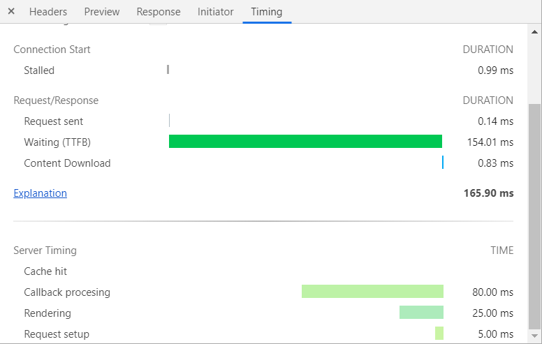

# Introduction
Implements a request filter that automatically collects performance notifications
during a request and adds them to the `Server-Timing` heading in the response, this enables the web development tools to show server timing information to
better analyze the timing of a request/response cycle.





# How to use

Add a `WAPerformanceTimingFilter` to your request handler as follows:

```smalltalk
myApp := (WADispatcher default handlerAt: 'myApp')
            addFilter: WAPerformanceTimingFilter new
```

Then in your code you signal performance notifications as follows:

```smalltalk
(WAPerformanceTiming name: 'callback' description: 'Callback procesing' duration: 80 milliseconds) signal
```

You can also do:

```smalltalk
WAPerformanceTiming measure: 'metricName' during: aBlock
```

# Installation

Load the `Seaside-PerformanceTiming` package from this repository.


# Remarks

## Header combination

Seaside's `WAHeaderFields` object corectly supports adding multiple values for the same header name via `aWAHeaderFields at: key add: value` or via `aWAResponse headerAt: key append: value`.

But the `ZnZincServerAdaptor>>responseFrom: aRequestContext` iteration over such headers only adds the last one. For this reason the filter manually updates the header value each time, breaking somehow the the encapsulation of `WAHeaderFields`. Once this is solved at the `ZnZincServerAdaptor` side, this behavior should be removed from the `WAPerformanceTimingFilter`.

## Counter behavior
Each timing notification gets immediately added to the request header, so there is no _"counter"_ functionality of each indicator. It is, if you signal a `WAPerformanceTiming` with the same name twice, this will be added twice as well to the headers. So it doesn't work as a performance counter of any sort.

# References

* [Server-Timing Working Draft](https://www.w3.org/TR/server-timing/)
* [Server-Timing MDN](https://developer.mozilla.org/en-US/docs/Web/HTTP/Headers/Server-Timing)
